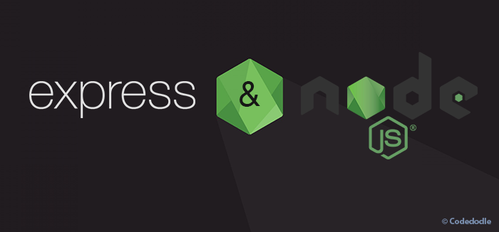
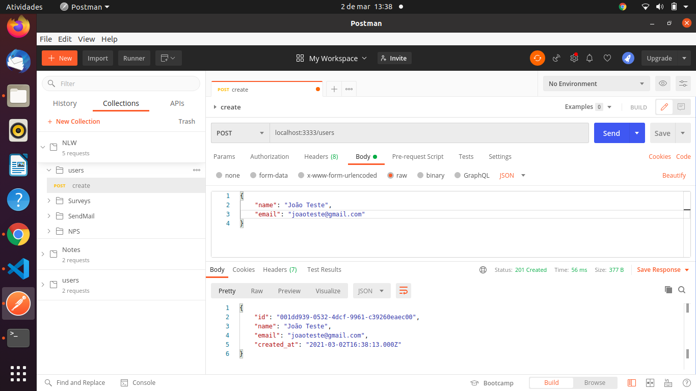
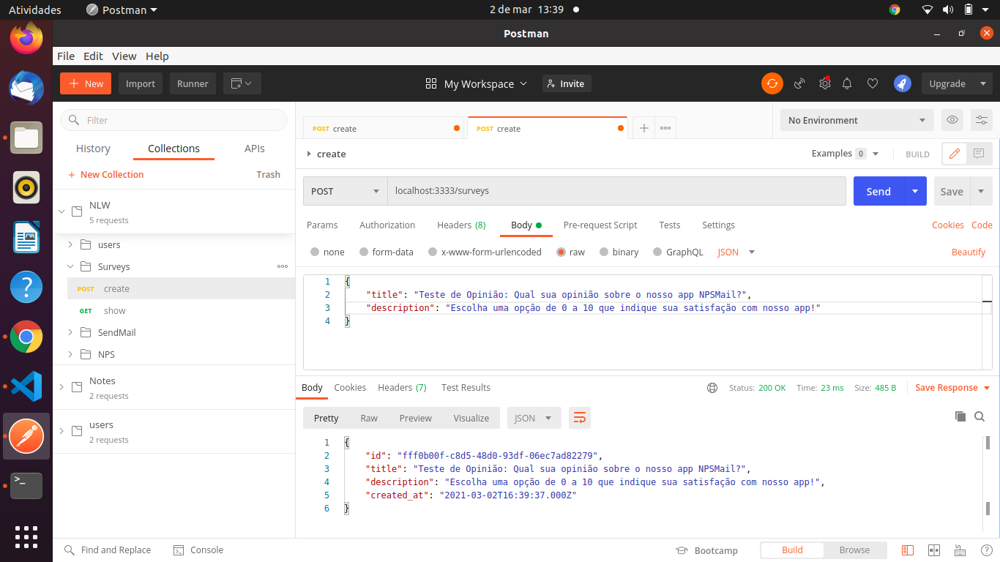
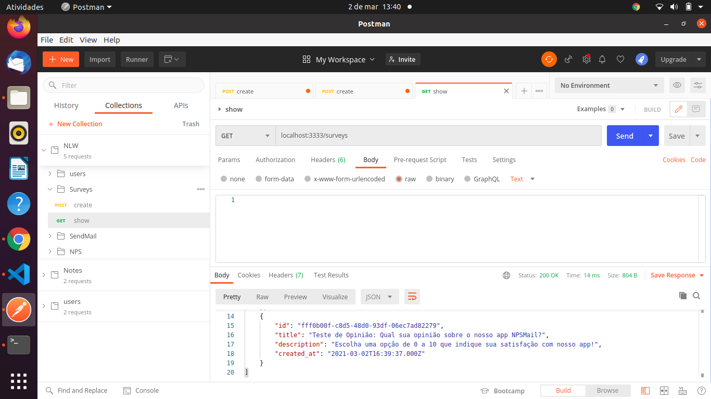
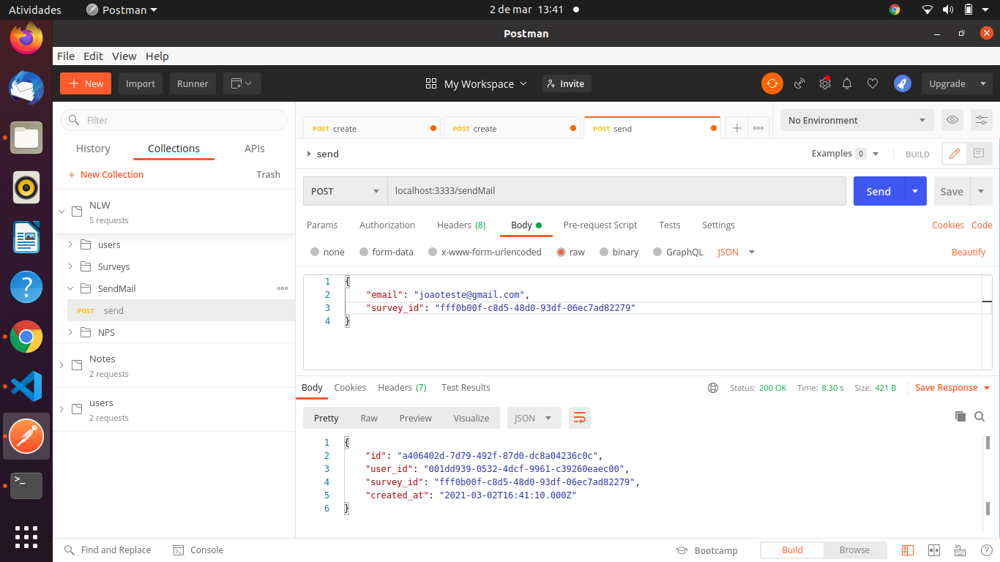
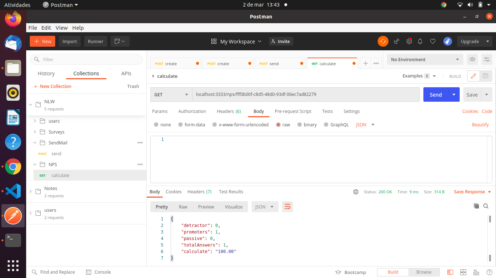

  

  <h1> NPSMail </h1>

<h3 align = "center">
  Uma aplicação para NPS via e-mail! 📨
</h3>

<h4 align = "center">
	✅ NPSMail 🚀 Versão 1.0 ✅
</h4>

 

 <a href="#visao">Visão geral</a> •
 <a href="#demonstracao">Demonstração</a> • 
 <a href="#requisitos">Pré-requisitos</a> • 
 <a href="#tecnologias">Pré-requisitos</a> • 
 <a href="#contato">Contato</a>

 
 
 
 

<h2>  Visão geral </h2>

NPSMail é uma aplicação criada em Node.js e Express para simular um serviço de NPS (Net Promoter Score), ou pesquisa de satisfação, por e-mail. A aplicação permite a criação de usuários, criação de pesquisas, votação direto no e-mail do usuário e ainda faz um cálculo das notas recebidas e devolve nas métricas finais.  

 
 
 

<h2> Demonstração da Aplicação</h2>

Veremos melhor agora como a aplicação funciona. Utilizando uma ferramenta de testes de serviços RESTful, o Postman, irei apresentar o passo a passo do que a aplicação permite fazer. 
 

<h4>Registrando o Usuário</h4>
Nesse momento, passamos no formato JSON o nome e e-mail de nosso usuário fictício "João Teste" para que fosse registrado em nosso banco de dados. O retorno, como você pode ver no screenshot abaixo, são as informações passadas acima e algumas complementadas pelo próprio backend da aplicação, como id e a data da criação do usuário.

 

<h4>Registrando uma Pesquisa</h4>
Uma vez que cadastramos o usuário, passamos no formato JSON novamente o título e a descrição da nossa primeira pesquisa, e ela é em seguida registrada no banco de dados. O retorno, como você pode ver no screenshot abaixo, são as informações passadas acima e algumas complementadas pelo próprio backend da aplicação, bem semelhante ao cadastro de um usuário, como id e a data da criação da pesquisa.

 

<h4>Mostrando todas as pesquisas</h4>
Após termos criado a nossa pesquisa, podemos assim exibir todas as pesquisas criadas até então no uso de nossa aplicação. Utilizando o método GET com a rota criada "surveys", podemos exibir o conjunto de pesquisas registradas até agora, como você pode ver no screenshot abaixo.

 

<h4>Enviando a pesquisa por e-mail</h4>
Agora, chegou o momento de enviar a pesquisa por e-mail. Para isso, selecionamos o id da pesquisa e o e-mail do usuário cadastrado para realizar o envio. O retorno é um JSON com as informações do usuário e da pesquisa, bem como um link gerado pelo Nodemailer para verificarmos o e-mail e votarmos na pesquisa. 

 

<h4>Votando com o Nodemailer</h4>
Utilizando o <i>catching service</i> Ethereal do Nodemailer, abrimos a pesquisa e conseguimos agora verificar as informações cadastrais, bem como uma breve mensagem de boas vindas ao usuário com as opções de notas para que ele consiga realizar a votação.

 

<h4>Apresentando os resultados</h4>
Voltando ao Postman, enviamos uma requisição do tipo POST passando a id da pesquisa na URL para verificarmos os resultados. O nosso retorno é o número de usuários em cada uma das categorias, como você pode verificar abaixo, o total de respostas e a porcentagem de satisfação (no exemplo abaixo, 100) com o serviço prestado (que desejamos que seja também a sua opinião sobre nossa aplicação 😄).

 
 
 

<h2>  Pré-requisitos </h2>
Antes de começar, você vai precisar ter instalado em sua máquina as seguintes ferramentas: Git, Node.js, Postman (caso deseje testar as rotas). Além disto é bom ter um editor para trabalhar com o código como VSCode.
 
<strong> Clone este repositório </strong>
$ git clone <https://github.com/tluis9/NPSMail>
 
<strong> Acesse a pasta do projeto no terminal/cmd</strong>
$ cd NPSMail
 
<strong> Instale as dependências </strong>
$ npm install
$ npm install express
$ npm install --global yarn
 
<strong> Execute a aplicação em modo de desenvolvimento </strong>
$ yarn dev
 
O servidor inciará na porta:3333 - acesse <http://localhost:3333> 

 
 
 

<h2>🛠 Tecnologias</h2>
As seguintes ferramentas foram usadas na construção do projeto:

- [Node.js] => (https://nodejs.org/en/)
- [TypeScript] => (https://www.typescriptlang.org/)
- [Yarn] => (https://classic.yarnpkg.com/en)
- [Express] => (https://expressjs.com/en)
- [Node-Postgres] => (https://node-postgres.com)
- [SQLite-3] => (https://www.sqlite.org/download.html)
- [Jest] => (https://jestjs.io)
- [Supertest, Yup, handlebars] => (https://www.npmjs.com/package)
- [Nodemailer] => (https://nodemailer.com/about)

 
 
 

<h2> Autor </h2>

<a href="#meulinkedin">
 
  
 <b>Tércio Luís</b></a> <a href="https://blog.rocketseat.com.br/author/thiago//" title="luis">🚀</a>

Feito com ❤️ por Tércio Luís 👋🏽 Entre em contato!

 ** <strong><a href="https://www.linkedin.com/in/t%C3%A9rcio-lu%C3%ADs-martins-ab3992207" style="text-decoration: normal;">  LinkedIn </a></strong>
  
 ** <strong><a href="https://www.instagram.com/featurecode_/" style="text-decoration: normal;">  Instagram </a></strong>
  
 ** E-mail direto: <strong>terciolmn98@gmail.com</strong> 

 
 
 